# Segmentação de Estradas e Ruas

Este trabalho foi desenvolvido durante o Bootcamp de Machine Learning oferecido pela Avanti.
O projeto foi dividido em duas etapas:

- Análise do dataset
- Implementação da CNN

## Análise do dataset

O dataset utilizado foi o [DeepGlobe Road Extraction](https://www.kaggle.com/datasets/balraj98/deepglobe-road-extraction-dataset) 
do Kaggle e foi realizada a análise completa para verificar se o mesmo estava em condições para ser trabalhado. A análise em questão envolveu:

- Verificação da integridade dos arquivos: Verificando se todas as imagens listadas estão presentes nos arquivos.
- Consistência dos metadados: Análise detalhada para garantir que os metadados estavam precisos e consistentes.
- Qualidade das imagens: Cada imagem foi cuidadosamente inspecionada para assegurar sua eficácia no treinamento do modelo.
- Detecção de duplicatas: Foi realizada uma busca minuciosa por duplicatas que pudessem interferir no desempenho do modelo.

#### Imagens do dataset
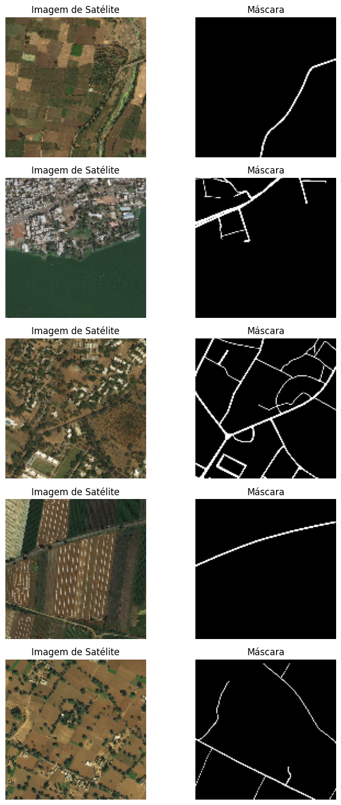

## U-Net

#### Estrutura da rede

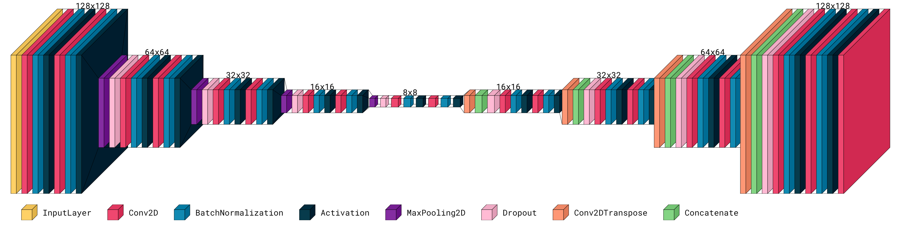

#### Gráfico de perda e acurácia

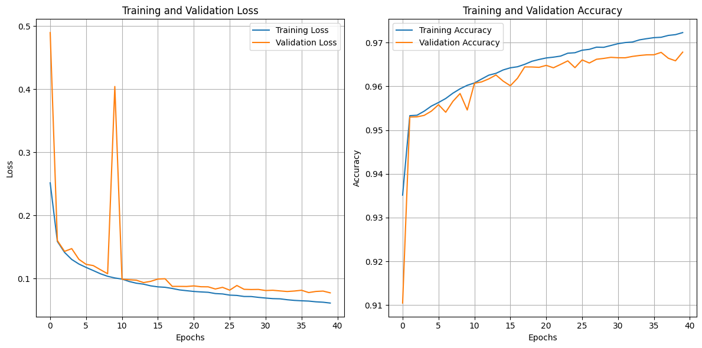

## Resultados

#### Testes com modelo para validação

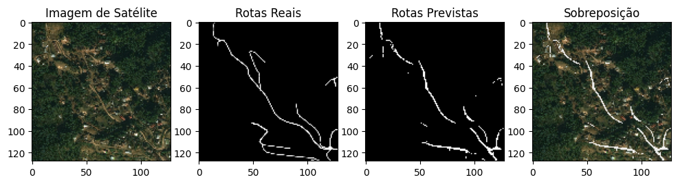
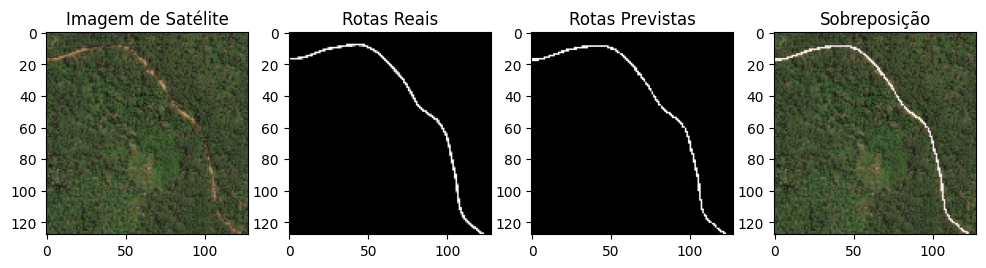
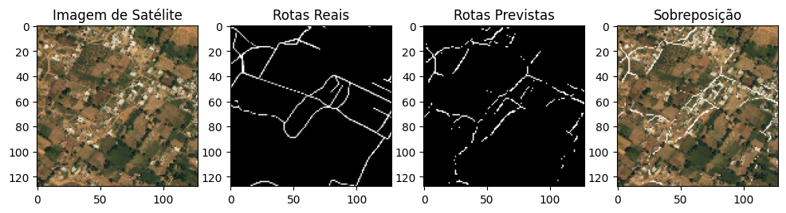
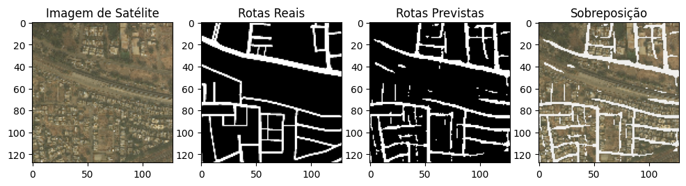
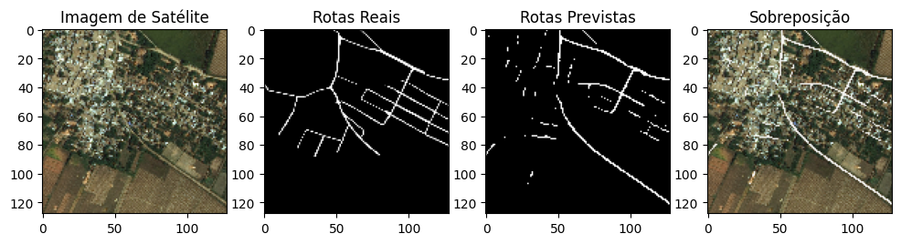

#### Testes

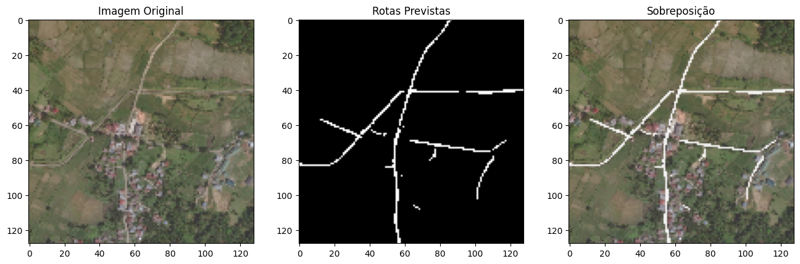
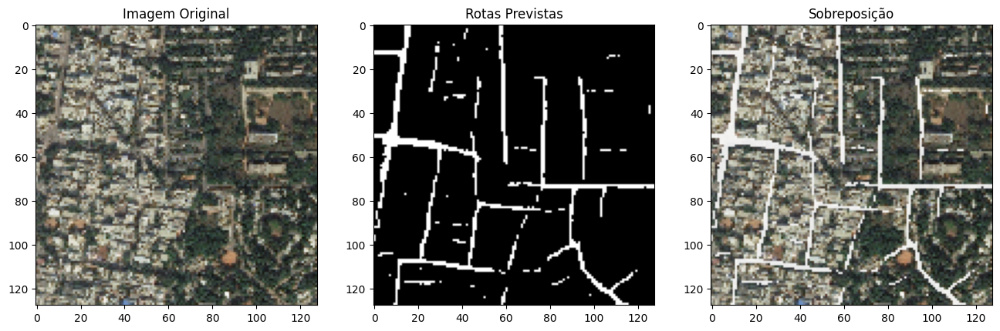
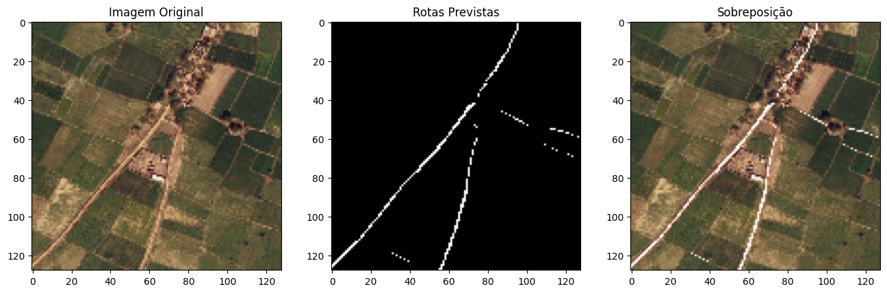
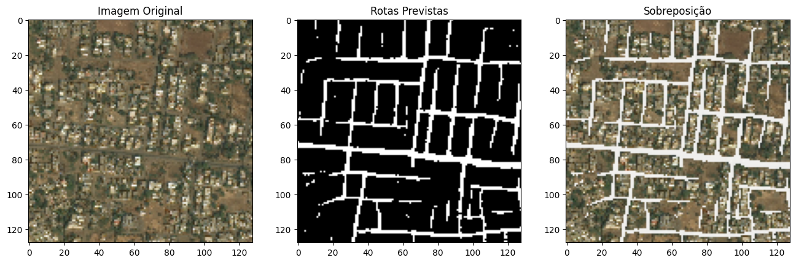
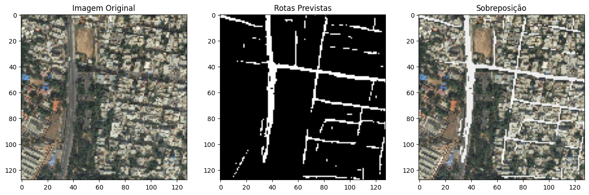